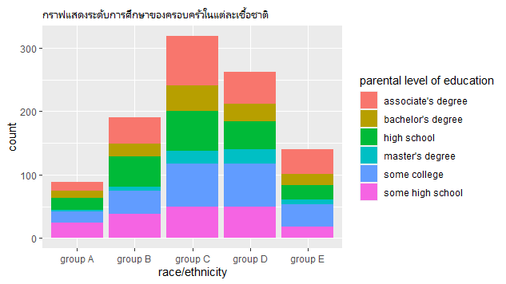

# EDA
### Outlines
1. Explore the dataset
2. Learning function from Tidyverse
3. Transform data with dplyr and finding insight the data
4. Visualization with GGplot2

## Part 1: Explore the dataset
```
StudentsPerformance<-read_csv("https://raw.githubusercontent.com/sit-2021-int214/037-StudentsPerformance/main/StudentsPerformance_original.csv")

View(StudentsPerformance)

```

## 5.raceใดที่มีคะแนนเฉลี่ยในmath scoreมากที่สุด
```
StudentsPerformance%>%group_by(`race/ethnicity`)%>%
summarise(avg=mean(`math score`))%>%
arrange(desc(`race/ethnicity`))%>%head(1)
```

```
  `race/ethnicity`   avg
  <chr>            <dbl>
1 group E           73.8
```
## Ans
group E เฉลี่ย 73.8

## 6.คนที่เข้าคอร์สเตรียมสอบมีคะแนนวิชาreadingเฉลี่ยเท่าไหร่
```
StudentsPerformance%>%group_by(`test preparation course`)%>%
summarise(avg=mean(`reading score`))%>%  
filter(`test preparation course` == 'completed')  
```
```
  `test preparation course`   avg
  <chr>                     <dbl>
1 completed                  73.9
```
## Ans
คะแนนเฉลี่ย 73.9


## 7.ระหว่างคนที่เข้าคอร์สเตรียมสอบและไม่ได้เตรียมสอบมีคะแนนเฉลี่ยวิชาwritingต่างกันเท่าไหร่

```
StudentsPerformance%>%group_by(`test preparation course`)%>%
summarise(avg=mean(`writing score`))%>%  
filter(`test preparation course` == 'completed')  
```

```
`test preparation course`   avg
 <chr>                     <dbl>
1 completed                  74.4  
```

```
StudentsPerformance%>%group_by(`test preparation course`)%>%
summarise(avg=mean(`writing score`))%>%  
filter(`test preparation course` == 'none')
``` 

```
`test preparation course`   avg
<chr>                     <dbl>
1 none                       64.5
```
## Ans
คนที่เข้าคอร์สเตรียมสอบมีคะแนนเฉลี่ยมากกว่าคนที่ไม่ได้เตรียมสอบ 9.9 คะแนน

  

## 8.แต่ละ parental level of education มี lunch แบบละเท่าใด 
```
StudentsPerformance%>%group_by(`parental level of education`)%>%
count(lunch)  
```
## Ans

```
   `parental level of education` lunch            n
   <chr>                         <chr>        <int>
 1 associate's degree            free/reduced    77
 2 associate's degree            standard       145
 3 bachelor's degree             free/reduced    44
 4 bachelor's degree             standard        74
 5 high school                   free/reduced    70
 6 high school                   standard       126
 7 master's degree               free/reduced    24
 8 master's degree               standard        35
 9 some college                  free/reduced    79
10 some college                  standard       147
11 some high school              free/reduced    61
12 some high school              standard       118
```

## กราฟ


```
จำนวนคนที่มีเชื้อชาติจากมากไปน้อยได้แก่group C,group D,group B,group E,group A โดยทุกเชื้อชาติจะมีการทานอาหารแบบ standardมากกว่าแบบ free/reduced

```


```
มีจำนวนmaleที่ผู้ปกครองเรียนในhigh schoolมากกว่าfemale
```