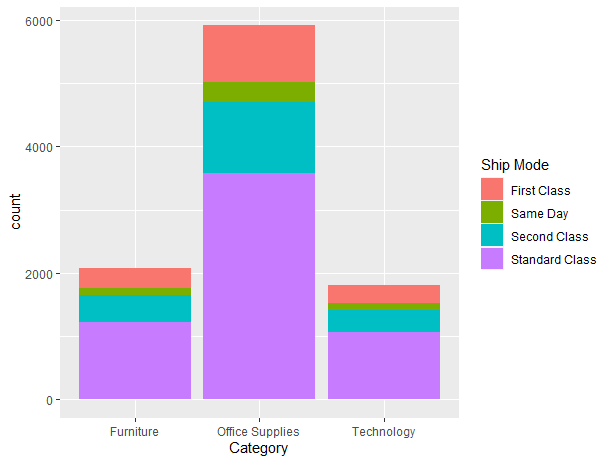

# R-Assignment 4

**Created by Name-Surname (ID: 62130500095)**

Dataset: Superstore Sales Dataset (Data from Rohit Sahoo,[Kaggle](https://www.kaggle.com/rohitsahoo/sales-forecasting)) >> [Using CSV](https://raw.githubusercontent.com/safesit23/INT214-Statistics/main/datasets/superstore_sales.csv)


### Outlines
1. Explore the dataset
2. Learning function from Tidyverse
3. Transform data with dplyr and finding insight the data
4. Visualization with GGplot2

## Part 1: Explore the dataset

```
# Library
library(dplyr)
library(readr)
library(ggplot2)

# Dataset
superstore <- read_csv("https://raw.githubusercontent.com/safesit23/INT214-Statistics/main/datasets/superstore_sales.csv")
View(superstore)
```

## Part 2: Transform data with dplyr and finding insight the data

### 1. Product name ที่มีการซื้อรวมมากที่สุด
```
superstore %>% group_by(`Product Name`) %>%
  summarise(Total_Sales = sum(Sales))  %>%
  arrange(desc(Total_Sales)) %>% head(1)


```

Result:

```
# A tibble: 1 x 2
  `Product Name`                        Total_Sales
  <chr>                                       <dbl>
1 Canon imageCLASS 2200 Advanced Copier      61600.
```
Canon imageCLASS 2200 Advanced Copierเป็นลูกค้าที่ซื้อเยอะที่สุด

### 2. 10 Top Spender
```
superstore %>% group_by(`Customer Name`) %>%
  summarise(Total_Sales = sum(Sales))  %>%
  arrange(desc(Total_Sales)) %>% head(10)
```

Result:

```
# A tibble: 10 x 2
   `Customer Name`    Total_Sales
   <chr>                    <dbl>
 1 Sean Miller             25043.
 2 Tamara Chand            19052.
 3 Raymond Buch            15117.
 4 Tom Ashbrook            14596.
 5 Adrian Barton           14474.
 6 Ken Lonsdale            14175.
 7 Sanjit Chand            14142.
 8 Hunter Lopez            12873.
 9 Sanjit Engle            12209.
10 Christopher Conant      12129.
```
Customer name ที่มีการซื้อสูงสุดคือ Sean Miller โดยมีการซื้อทั้งหมด25043

### 3. การส่งสินค้ารูปแบบไหนได้รับความนิยม
```
superstore %>% group_by(`Ship Mode`)%>%count()%>%
  arrange(desc(n)) 

```

Result:

```
# Groups:   Ship Mode [4]
  `Ship Mode`        n
  <chr>          <int>
1 Standard Class  5859
2 Second Class    1902
3 First Class     1501
4 Same Day         538
```
แบบที่มีความนิยมมากที่สุดคือStandard Class และความนิยมน้อยที่สุดคือSame Day

### 4. สินค้าที่มีราคาแพงสุด และถูกสุดที่ถูกซื้อไป
```
superstore %>%
filter(Sales==max(Sales))%>%
select(`Product Name`,Sales);

superstore %>%
  filter(Sales==min(Sales))%>%
  select(`Product Name`,Sales)


```

Result:

```
  `Product Name`                                         Sales
  <chr>                                                  <dbl>
1 Cisco TelePresence System EX90 Videoconferencing Unit 22638.

# A tibble: 1 x 2
  `Product Name`                                                             Sales
  <chr>                                                                      <dbl>
1 Hoover Replacement Belt for Commercial Guardsman Heavy-Duty Upright Vacuum 0.444
```
สินค้าที่มีราคาแพงสุดคือ 22638 และถูกสุดที่คือ 0.444

### 5. ประเภทของสินค้าที่ได้รับความนิยมมากที่สุด
```
superstore %>%group_by(Category)%>%count()%>%
  arrange(desc(n)) %>% head(1)
```

Result:

```
# Groups:   Category [1]
  Category            n
  <chr>           <int>
1 Office Supplies  5909
```
ประเภทของสินค้าที่ได้รับความนิยมมากที่สุดคือOffice Supplies

### 6. เมืองที่มีลูกค้าซื้อมากที่สุด
```
superstore %>% group_by(City,`Customer Name`) %>%
 count()%>%arrange(desc(n))%>%head(1)

```

Result:

```
# Groups:   City, Customer Name [1]
  City          `Customer Name`     n
  <chr>         <chr>           <int>
1 New York City Seth Vernon        14
```
เมืองNew York มีลูกค้าเยอะที่สุดจำนวน14

## Part 3: Visualization with GGplot2
### 1.) Graph show relation between height and mass
```
superstore %>% ggplot(aes(x=`Category`)) + geom_bar(aes(fill=`Ship Mode`))
```
Result:



```
categoryประกอบด้วย Furniture,office supplies,technology
โดยทุกcategoryจะมีการส่งแบบstandardมากที่สุดและจะส่งแบบsamdayน้อยที่สุด