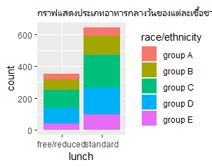
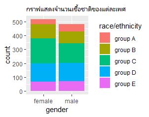

### Outlines
1. Explore the dataset
2. Learning function from Tidyverse
3. Transform data with dplyr and finding insight the data
4. Visualization with GGplot2

## Part 1: Explore the dataset

```
StudentsPerformance<-read_csv("https://raw.githubusercontent.com/sit-2021-int214/037-StudentsPerformance/main/StudentsPerformance_original.csv")

View(StudentsPerformance)

```

## Part 2: Transform data with dplyr and finding insight the data

## 5.เพศที่มีการเข้าคอร์สเตรียมสอบมากที่สุด

```
StudentsPerformance_original %>% select(test.preparation.course,gender) %>% filter(test.preparation.course != "none") %>% group_by(gender) %>% count() %>% arrange(desc(n))
```

Ans
```
  gender     n
  <chr>  <int>
1 female   184
2 male     174
```


## 6.นักเรียนกินอาหารแบบไหนมากที่สุด

```
StudentsPerformance_original %>% group_by(lunch) %>% count() %>% arrange(desc(n))
```


Ans
```
 Groups:   lunch [2]
  lunch            n
  <chr>        <int>
1 standard       645
2 free/reduced   355
> 
```


## 7.นักเรียนเชื้อชาติใดที่คะแนนreadingมากกว่าค่าเฉลี่ยเยอะที่สุด

```
StudentsPerformance_original %>% filter(reading.score>mean(reading.score)) %>% group_by(race.ethnicity) %>% count()%>% arrange(desc(n))
```
Ans
```
# Groups:   race.ethnicity [5]
  race.ethnicity     n
  <chr>          <int>
1 group C          163
2 group D          143
3 group E           89
4 group B           85
5 group A           33
```


## 8.นักเรียนที่คะแนนคณิตศาสตร์ตํ่ากว่า50 กินอาหารแบบใดมากที่สุด

```
StudentsPerformance_original %>% filter(math.score<50) %>% group_by(lunch) %>% count()%>% arrange(desc(n))
```

Ans
```
# Groups:   lunch [2]
  lunch            n
  <chr>        <int>
1 free/reduced    96
2 standard        39
```


## กราฟ




## graph3
```
StudentsPerformance %>% ggplot(aes(x= lunch)) + geom_bar(aes(fill=`race/ethnicity` ))+ ggtitle("กราฟแสดงประเภทอาหารกลางวันของแต่ละเชื้อชาติ")

```


## graph4
```
StudentsPerformance %>% ggplot(aes(x= `gender`)) + geom_bar(aes(fill=`race/ethnicity`))+ ggtitle("กราฟแสดงจำนวนเชื้อชาติของแต่ละเพศ")

```


